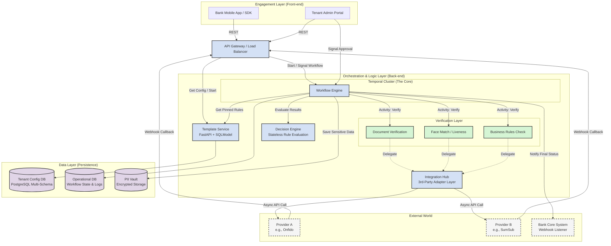
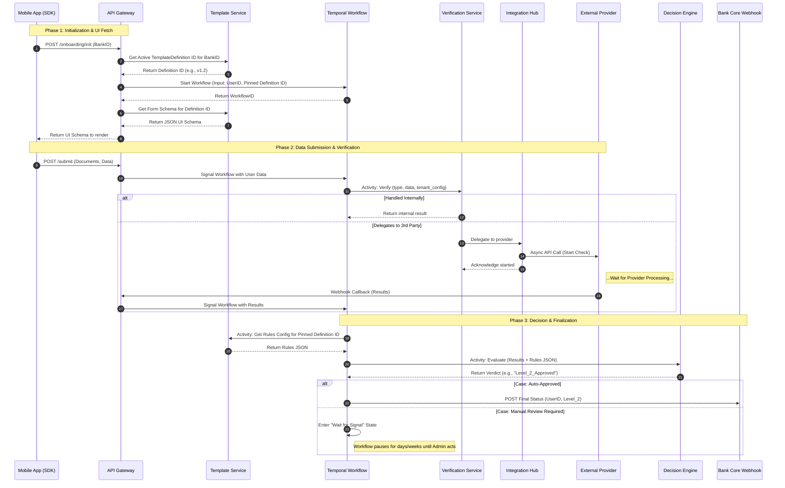

# Onboarding & Verification SaaS — Architecture Documentation

## 1. System Architecture

A **multi-tenant, workflow-driven onboarding & KYC verification platform** that lets banks (tenants) customize customer onboarding flows without code changes.



---

## 2. Component Interactions

### 2.1 Engagement Layer → API Gateway

| From | To | Protocol | Purpose |
|---|---|---|---|
| Bank Mobile App / SDK | API Gateway | REST | Submit onboarding data, fetch form schemas |
| Tenant Admin Portal | API Gateway | REST | Configure templates, approve/reject flagged cases |

### 2.2 API Gateway → Orchestration Layer

| From | To | Purpose |
|---|---|---|
| API Gateway | Template Service | Fetch active `TemplateDefinition`, get form schema JSON |
| API Gateway | Workflow Engine | Start new workflows, signal workflows with user data or webhook results |

### 2.3 Workflow Engine → All Services

The Workflow Engine is the **central orchestrator**. It never calls external APIs directly — it delegates all work through Activities.

| From | To | Interaction Type | Purpose |
|---|---|---|---|
| Workflow Engine | Template Service | Activity | Get pinned rules config for the definition the user started with |
| Workflow Engine | Verification Services | Activity | Trigger document, face, or business rule verification |
| Workflow Engine | Decision Engine | Activity | Evaluate all verification results against tenant rules → verdict |
| Workflow Engine | Bank Core System | Activity | POST final onboarding status (approve/reject) via webhook |
| Admin Portal | Workflow Engine | Signal | Approve or reject a manually-flagged case |

### 2.4 Verification Services → Integration Hub

Custom Verification Services contain **Kifiya-built verification logic**. They decide at runtime whether to handle verification internally or delegate to a third-party provider via the Integration Hub.

| From | To | When | Purpose |
|---|---|---|---|
| Document Verification | Integration Hub | OCR confidence is low | Delegate to Onfido for higher-confidence document check |
| Face Match / Liveness | Integration Hub | Regulated liveness required | Delegate to SumSub for certified liveness detection |
| Business Rules Check | Integration Hub | External watchlist needed | Delegate for sanctions/PEP screening |

> **Key design point:** The Workflow Engine doesn't know or care whether verification happens internally or externally. It calls a Verification Service activity and gets back a normalized result.

### 2.5 Integration Hub → External World

| From | To | Protocol | Purpose |
|---|---|---|---|
| Integration Hub | Provider A (Onfido) | Async REST | Start verification check |
| Integration Hub | Provider B (SumSub) | Async REST | Start verification check |
| Provider A | API Gateway | Webhook | Return verification results |
| Provider B | API Gateway | Webhook | Return verification results |

### 2.6 Data Connections

| From | To | Purpose |
|---|---|---|
| Template Service | Tenant Config DB | Read/write template definitions, form schemas, rules (per-tenant schema) |
| Workflow Engine | Operational DB | Workflow execution state, task history, audit logs |
| Workflow Engine | PII Vault | Store/retrieve sensitive user data (ID photos, SSN, etc.) |

---

## 3. Onboarding Sequence Flow



| Phase | What Happens | Key Design Point |
|---|---|---|
| **1. Initialization** | SDK sends bank ID → Template Service resolves active definition → Temporal workflow starts with **pinned** definition ID → form schema returned to SDK | Definition is pinned at workflow start — template updates don't affect in-progress users |
| **2. Verification** | User submits data → workflow calls Verification Service → handles internally or delegates to Integration Hub → results flow back | Fully async & durable — Temporal workflow survives provider delays of hours/days |
| **3. Decision** | Workflow fetches pinned rules → Decision Engine evaluates → auto-approve or escalate to manual review → bank notified | Manual review parks the workflow indefinitely until admin signals |

---

## 4. Gap Analysis

### ✅ Implemented

| Component | Details |
|---|---|
| Template Service | Full CRUD for `Template` + `TemplateDefinition` with versioning |
| Tenant Management | Registration, schema provisioning, Alembic per-schema migrations |
| Multi-Tenant DB | PostgreSQL `search_path` isolation, `X-Tenant-ID` middleware |
| Form Schema Validation | Pydantic-validated field types: text, dropdown, radio, checkbox, date, fileUpload, signature |
| Version Pinning Model | Header/detail pattern with `active_version_id`; immutability on active definitions |
| Database & Migrations | Async PostgreSQL, Alembic, Docker Compose dev |

### ❌ Missing

| # | Component | Priority | Effort |
|---|---|---|---|
| 1 | Temporal Workflow Engine (cluster + SDK) | 🔴 Critical | Large |
| 2 | Onboarding Workflow Definition | 🔴 Critical | Large |
| 3 | Decision Engine | 🔴 Critical | Medium |
| 4 | Custom Verification Services | 🔴 Critical | Large |
| 5 | Integration Hub (adapter layer) | 🔴 Critical | Medium |
| 6 | Webhook Receiver | 🔴 Critical | Medium |
| 7 | Onboarding API Routes (`/init`, `/submit`) | 🔴 Critical | Medium |
| 8 | PII Vault | 🟡 High | Medium |
| 9 | API Gateway / Load Balancer | 🟡 High | Small |
| 10 | Bank Core Webhook Notifier | 🟡 High | Small |
| 11 | Authentication & Authorization | 🟡 High | Medium |
| 12 | Provider Configuration Model | 🟡 High | Medium |
| 13 | Admin Portal (frontend) | 🟡 High | Large |
| 14 | Mobile SDK (frontend) | 🟡 High | Large |
| 15 | Manual Review Signal flow | 🟡 High | Small |
| 16 | Operational DB / Workflow Logs | 🟢 Medium | Small |

> **Coverage:** ~20% — the Template Service and Tenant Management foundation is built. The entire workflow orchestration, verification, decision, and frontend layers remain.

---

## 5. Recommended Build Order

| Phase | Components | Deliverable |
|---|---|---|
| **Phase 1** | Temporal cluster + Onboarding Workflow + Onboarding API routes | End-to-end happy path with mocked verification |
| **Phase 2** | Decision Engine + Custom Verification Services + Integration Hub + Webhook Receiver | Real verification (internal + third-party) |
| **Phase 3** | PII Vault + Bank Core Notifier + Auth + Provider Config | Production security and bank integration |
| **Phase 4** | Admin Portal + Manual Review + Mobile SDK | Complete user-facing experience |

---

## 6. File Structure

```
onboarding-and-verification-saas/
├── app/
│   ├── main.py                          # FastAPI entrypoint
│   ├── core/
│   │   ├── config.py                    # Settings (env-based)
│   │   └── context.py                   # Tenant ContextVar
│   ├── db/
│   │   ├── session.py                   # Async engine + tenant-scoped sessions
│   │   └── migrations.py               # Schema provisioning + Alembic helpers
│   ├── middleware/
│   │   └── tenants.py                   # X-Tenant-ID header extraction
│   ├── models/
│   │   ├── base.py                      # AuditBase mixin
│   │   ├── shared/tenant.py             # Tenant model (public schema)
│   │   └── tenant_scoped/template.py    # Template + TemplateDefinition models
│   ├── schemas/
│   │   ├── templates/template.py        # API request/response schemas
│   │   ├── templates/form_schema.py     # Form field type definitions
│   │   └── tenants/tenant.py            # Tenant API schemas
│   ├── routes/
│   │   ├── templates/template.py        # Template CRUD endpoints
│   │   └── tenants/tenant.py            # Tenant CRUD endpoints
│   └── services/
│       ├── templates/template.py        # Template business logic
│       └── tenants/tenant.py            # Tenant business logic
├── alembic/                             # Migration scripts
├── docs/
│   └── architecture.md                  # This document
├── Dockerfile
├── docker-compose.dev.yaml
└── pyproject.toml
```
