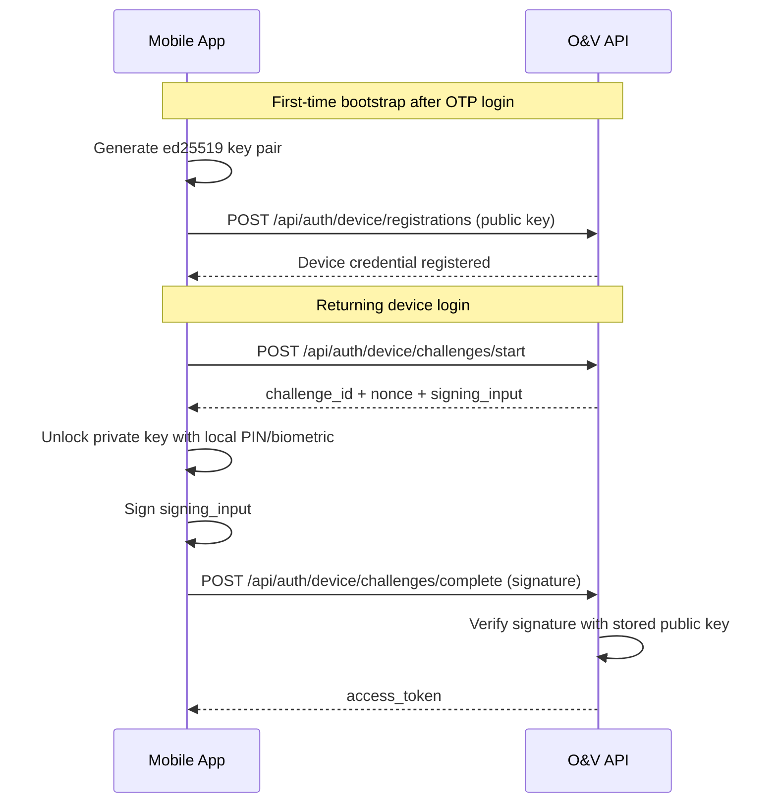

# Mobile Device Challenge Auth

## Recommendation

Do not build this as raw RSA plus “encrypt with private key”.

Use:

- OTP only for initial bootstrap or device recovery
- device-generated asymmetric key pair
- server nonce challenge
- digital signature over the exact server-provided payload
- short-lived access token after successful verification

For this repo, the implemented reference flow uses `ed25519`, not RSA.

Why:

- simpler than RSA
- faster on mobile
- smaller keys and signatures
- fits the “cost-effective” requirement better

## Flow



## Backend Endpoints

- `POST /api/auth/device/registrations`
- `GET /api/auth/device/registrations`
- `DELETE /api/auth/device/registrations/{credential_id}`
- `POST /api/auth/device/challenges/start`
- `POST /api/auth/device/challenges/complete`

## Backend API Example

### 1. Register a device after OTP/bootstrap login

Use a normal authenticated token from your existing login flow:

```bash
curl -sS -X POST "http://127.0.0.1:7090/api/auth/device/registrations" \
  -H "Authorization: Bearer <bootstrap-access-token>" \
  -H "Content-Type: application/json" \
  -d '{
    "device_id": "VvM_zQWnYkzM0U7r9sQhVQ",
    "device_name": "Berhanu Pixel",
    "algorithm": "ed25519",
    "public_key_b64u": "<public-key-b64u>",
    "login_hint": "+2519...",
    "pin_protected": true,
    "metadata": {
      "platform": "android",
      "app_version": "1.0.0"
    }
  }'
```

### 2. Start a challenge for returning login

```bash
curl -sS -X POST "http://127.0.0.1:7090/api/auth/device/challenges/start" \
  -H "Content-Type: application/json" \
  -d '{
    "tenant_id": "abyssinia_corp",
    "subject": "user-123",
    "device_id": "VvM_zQWnYkzM0U7r9sQhVQ"
  }'
```

Response shape:

```json
{
  "challenge_id": "9d8d...",
  "credential_id": "7f5a...",
  "algorithm": "ed25519",
  "nonce": "base64url-nonce",
  "signing_input": "challenge_id=...\ntenant_id=...\nsubject=...\ndevice_id=...\nnonce=...\nissued_at=...\nexpires_at=...",
  "expires_at": "2026-03-28T12:00:00Z"
}
```

### 3. Sign locally and complete the challenge

```bash
curl -sS -X POST "http://127.0.0.1:7090/api/auth/device/challenges/complete" \
  -H "Content-Type: application/json" \
  -d '{
    "challenge_id": "9d8d...",
    "signature_b64u": "<signature-over-signing_input>"
  }'
```

Response:

```json
{
  "access_token": "<mobile-session-jwt>",
  "token_type": "bearer",
  "expires_in": 900,
  "subject": "user-123",
  "tenant_id": "abyssinia_corp",
  "device_id": "VvM_zQWnYkzM0U7r9sQhVQ",
  "auth_provider": "device_challenge",
  "roles": ["maker"]
}
```

## Important Limits

This is a practical reference implementation, not full passkey/WebAuthn parity.

What it does:

- stores a per-device public key
- creates one-time expiring challenges
- verifies `ed25519` signatures
- issues a local mobile session JWT accepted by the existing auth middleware

What you should still add for production hardening:

- device attestation
- biometric or OS-keystore backed private key operations
- per-device risk controls and rate limits
- refresh token or rotating session support
- Keycloak role refresh on each device login instead of using a stored role snapshot
- device management UI and admin revocation flows

## Flutter SDK

Reference Flutter package:

- [flutter_ov_device_auth](/Users/berhanu.tarekegn/git/onboarding-and-verification/sdk/flutter_ov_device_auth)

Minimal usage:

```dart
final keyStore = SecureStorageEd25519KeyStore();
final client = DeviceAuthClient(
  baseUrl: 'http://127.0.0.1:7090',
  keyStore: keyStore,
);

final deviceId = SecureStorageEd25519KeyStore.generateDeviceId();

await client.registerDevice(
  bearerToken: accessTokenFromOtpBootstrap,
  deviceId: deviceId,
  deviceName: 'Berhanu Pixel',
  loginHint: '+2519...',
);

final login = await client.loginWithDevice(
  tenantId: 'abyssinia_corp',
  subject: storedSubject,
  deviceId: deviceId,
  requireLocalUnlock: () async {
    // Trigger local PIN or biometric prompt here.
  },
);
```

## Backend Config

Add these env vars:

```env
MOBILE_AUTH_ENABLED=true
MOBILE_AUTH_ISSUER=ov-mobile
MOBILE_AUTH_HS256_SECRET=replace-with-long-random-secret
MOBILE_AUTH_ACCESS_TOKEN_TTL_SECONDS=900
MOBILE_AUTH_CHALLENGE_TTL_SECONDS=120
```

Then run:

```bash
./.venv/bin/python scripts/migrate.py --public-only
```

Restart the API after changing env vars.
